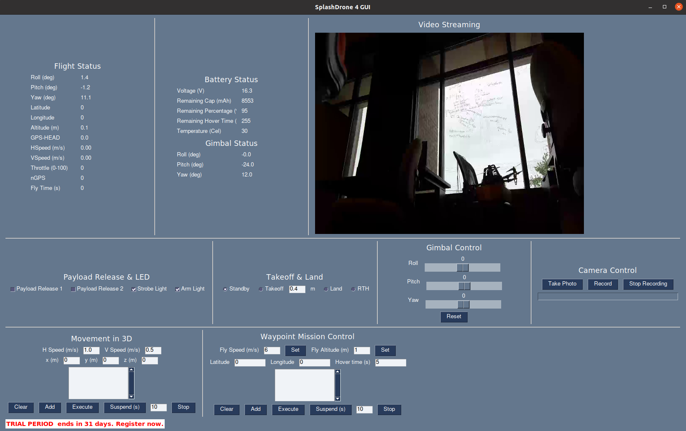

# SplashDrone4-ros
The ROS2 package for the SplashDrone4, a drone developed by [Swellpro](https://www.swellpro.com/). 
This package allows you to control the drone and access its telemetry data. 
Code are supposed to be running on Ubuntu 22.04 with ROS Humble.

## System Dependencies
We only need the C-version of [ZeroMQ](https://github.com/zeromq/libzmq):
```shell
sudo apt install libzmq3-dev
```

## Python Dependencies
[Miniconda](https://www.anaconda.com/docs/getting-started/miniconda/main) is recommended to manage Python dependencies. 
After installing Miniconda, you can create a new environment and install the required Python packages:
```shell
conda create -n splashdrone python=3.10
conda activate splashdrone
pip install -r requirements.txt
```
Since PySimpleGUI is not available on PyPI, you need to install it from the source:
```shell
pip install --upgrade --extra-index-url https://PySimpleGUI.net/install PySimpleGUI
```

## Build the Package
Make a workspace and clone the package:
```shell
mkdir -p ~/splashdrone_ws/src
git clone git@github.com:EdisonPricehan/SplashDrone4-ros.git
git checkout ros2
cd ~/splashdrone_ws
source /opt/ros/humble/setup.bash
colcon build --symlink-install
```

## Run the Package
After building the package, you can launch the drone control GUI:
```shell
source ~/splashdrone_ws/install/setup.bash
ros2 launch splashdrone start_all.launch.py
```
The GUI will appear, and you can control the drone using the buttons and sliders.



## Troubleshooting
- If encounter runtime error like 'GLIBCXX_3.4.30' not found, it is probably due to the conflict between ROS2 and Miniconda.
You can try 
```shell
conda install -c conda-forge libstdcxx-ng
```
- If there is incompatibility between opencv and numpy, try downgrading numpy:
```shell
pip install numpy==1.24.4
```


  

